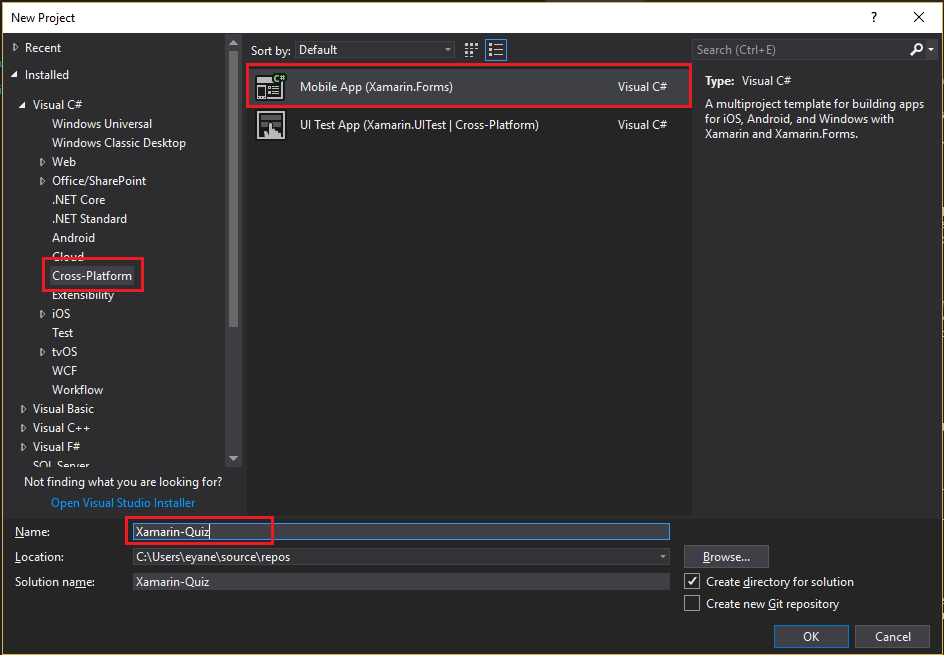

# 1. Hola Mundo!

Durante todo el workshop vamos a trabajar con un proyecto desde 0, generando una aplicación en la cual se pueda realizar una registracion mediante redes sociales y un pequeño Quiz.

En este modulo vamos a aprender a generar una aplicación y como ejecutarla, nos servira además para saber si tenemos el ambiente correctamente instalado para poder avanzar con el workshop.

## Creación del nuevo proyecto

La explicación de como generar un nuevo proyecto se realizará para Windows y para Mac por separado, ya que existen pequeños detalles que varian entre los IDE, dirigere a la sección que corresponda según tu Sistema Operativo.

### Windows

Lo primero que vamos a hacer es abrir Visual Studio.

1. Una vez abierto nos dirigiremos a **Archivo** -> **Nuevo** -> **Proyecto**

_Nuevo Proyecto_

1. Desde la ventana de **Nuevo Proyecto**, seleccionar **Cross-Platform** y luego **Mobile App (Xamarin.Forms)**. Como nombre de proyecto ingresaremos **Xamarin-Quiz**.

_Seleccion Proyecto_

1. Por último, seleccionaremos la configuración de la aplicación. Destildar la opción **Windows (UWP)** y seleccionar **.NET Standard** como estrategia. Para este taller vamos a utilizar el template de **Blank App**.

_Configuración Proyecto_

Dirigirse a la sección Estructura del Proyecto para continuar.

### Mac

// TODO

## Estructura del proyecto

Lo primero que vamos a ver es la estructura de la solución. Si deseleccionamos la opción **Windows (UWP)** como se indico en el módulo anterior, nuestra solución constara de 3 proyectos.

_Estructura del Proyecto_

1. *XamarinQuiz*: Este proyecto es el Core de la aplicación. Aproximadamente el 90% del código de la aplicación se escribirá en este proyecto, ya que es el código compartido entre las aplicaciones.

2. *XamarinQuiz.Android*: Este proyecto es específico para Android. En caso de requerir escribir codigo solo para Android, este el el proyecto que utilizaremos. Además, será el proyecto que debemos tener seleccinado como principal para ejecutar en Android.

3. *XamarinQuiz.iOS*: Este proyecto es específico para iOS. Es igual al proyecto anterior, pero para iOS.

## Ejecucion del Proyecto

Una vez cargado el proyecto, simplemente ejecutarlo. Se abrirá el emulador mostrando la pantalla de **Hello World**.

_Hola Mundo Android_

## Conclusión

En este modulo vimos como generar un nuevo proyecto en Xamarin.Forms, el mismo vamos a utilizarlo a lo largo de todo el workshop.

## Proximo Módulo

Avanzar al [módulo 2](../02-azure-mobile-app)
